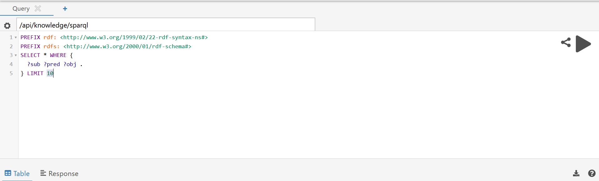
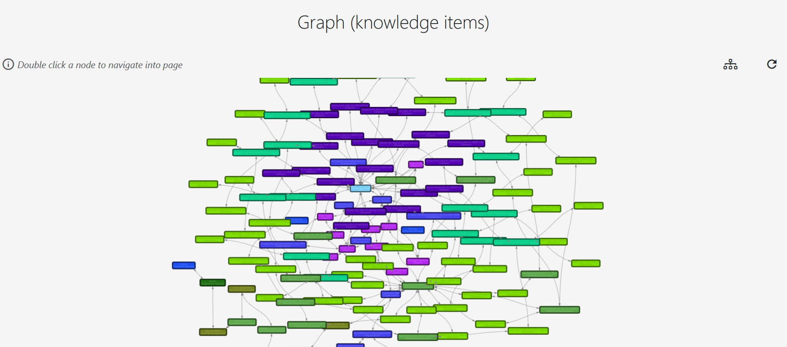

# Explore the dataspace

Discover how to explore the dataspace and utilize its features effectively. For an introduction how to navigate to the following functionalities, please refer to the [Navigation section](navigation.md).

- **Free-text Search**: This feature allows you to perform a simple search for k-items stored in the system. You can enter free-text to locate k-items based on their names and associated annotations. To narrow your search to a specific k-type, you can specify the desired k-type.

- **SPARQL Console**: This console enables advanced search capabilities using SPARQL queries, providing greater flexibility in retrieving data.

- **Vocabulary**: This section offers an overview of the ontological concepts available within the system, showing all vocabulary terms registered in the dataspace. Users can register new vocabulary terms here also; however, the creation of new vocabulary namespaces is restricted to admin users.

<!--  -->

- **Graph**: This feature displays the complete k-item graph, illustrating all k-items stored in the system along with their interconnections.

