# Knowledge handling

Learn how to handle knowledge, i.e. registering/ creating k-items.

## Create k-items

After clicking on the "Knowledge" tab, you will be taken to the k-items creation page. 

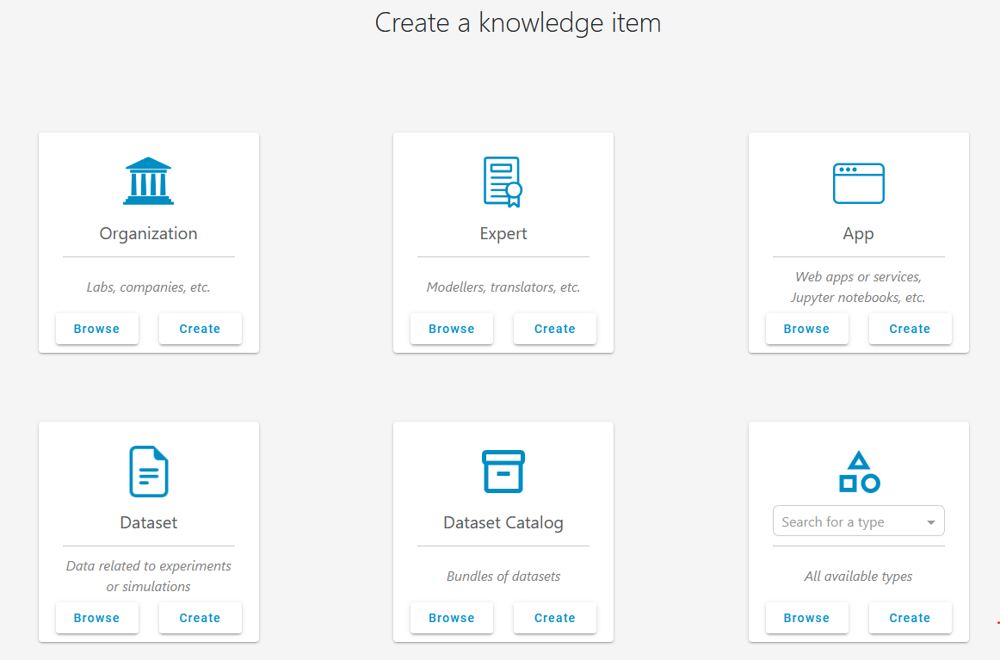

Here, you can browse existing or create new k-items with a default k-type:

- Your organization
- Yourself as an expert
- Applications
- Datasets (e.g., measurement data)
- Dataset catalogs (used for organizing datasets)

Additionally, you have the option to browse and create k-items that have been defined by a customized k-type created by an admin.

## Creating a k-item

Before outlining the process for creating a new k-item, it is important to get an impression of the k-item page, which displays all relevant information about a k-item.

### The k-item page

By clicking on the "Browse" button inside the "Dataset" grid card, you will see a list of all existing dataset k-items in the system. Chose any one of the list and you will get to the k-item page of it.

At the top of the k-item page, you will find a header displaying the item's name, ID, k-type (in this case, Dataset), and an avatar. Below the header, there is a section for a brief summary (free text) followed by the associated metadata, which includes key-value pairs and key-value-unit pairs typically aligned with a predefined ontological concept. If you have the appropriate permissions, you can delete the k-item using the "more options" icon (three vertical dots).

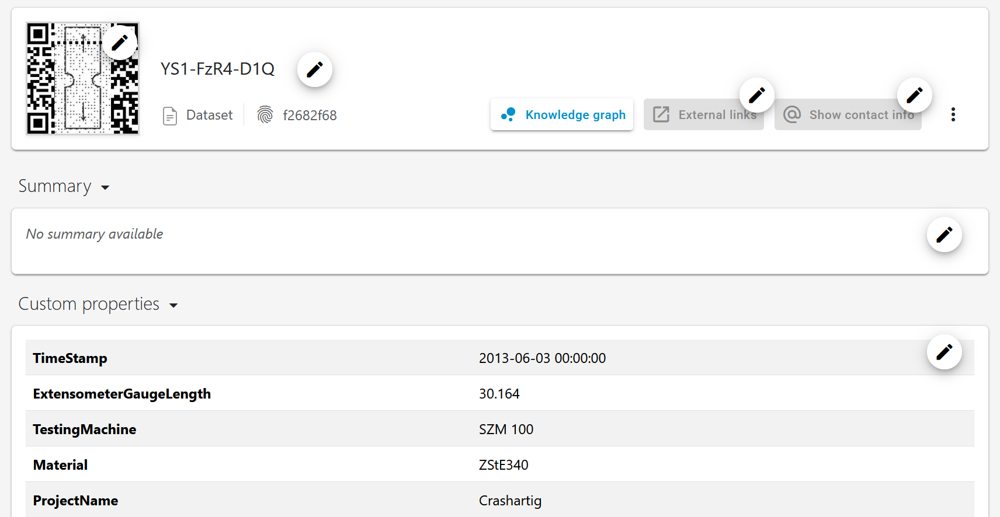

Additionally, you can view the RDF subgraph of the k-item (if available) by clicking the "Knowledge graph" button. This will display the ontological relationships that underlie the k-item's metadata.

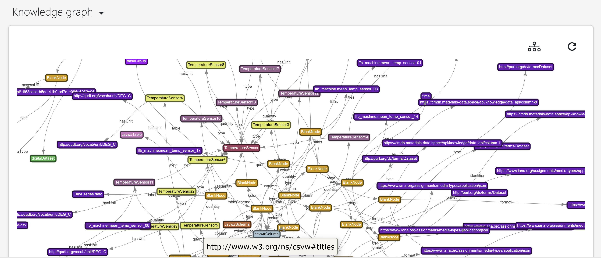

Below the metadata setion, you can view array data (typically time series data in terms of experimental measurements). You can customize the plot by selecting the data columns to be displayed on the x and y axes.

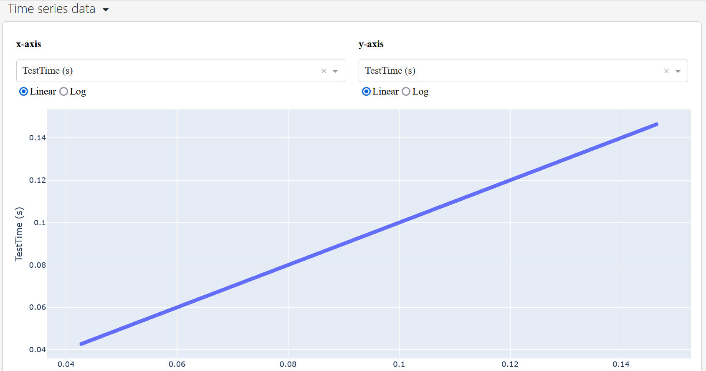

you can find attachments (often raw data files), information about applications that interact with the data, and annotations used to tag similar k-items and enhance searchability.

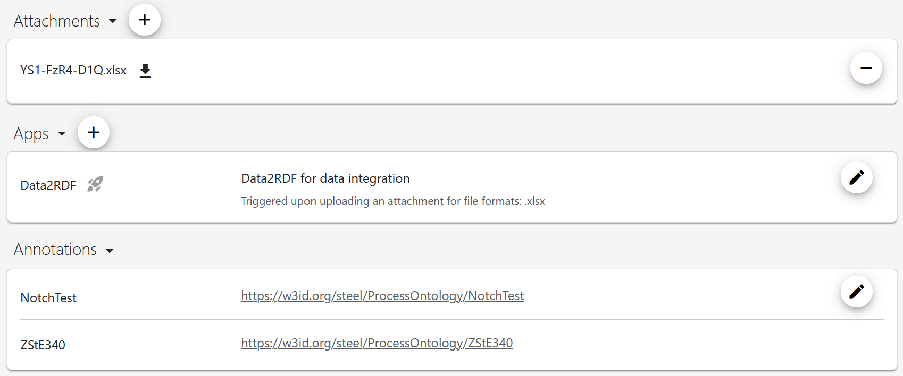

Further down, you will find the graph view, which displays all k-items linked to the selected k-item. By adjusting the depth, you can control the number of neighboring k-items displayed (depth=1 shows only the immediate neighbors, while depth=2 includes the neighbors of those neighbors, and so on).

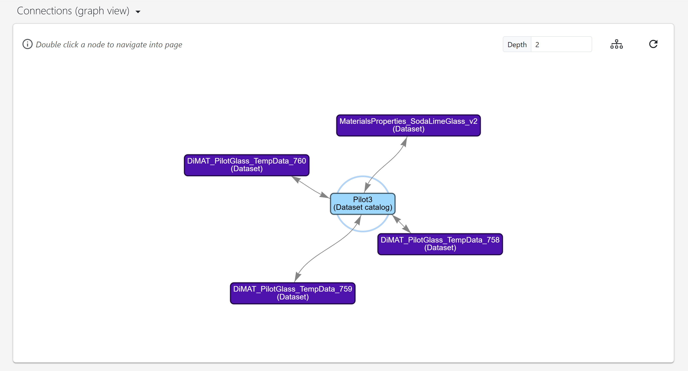

At the bottom, you will find a summary of the linked k-items, with connections organized by k-types for better clarity. You can add additional k-items by clicking the "Add" button on the right.

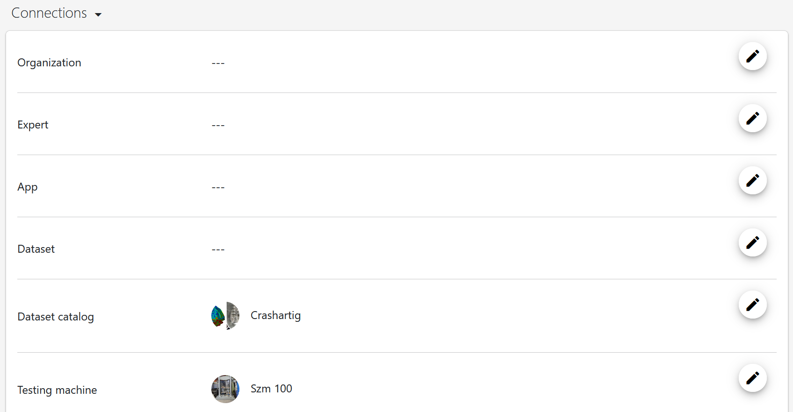

### Creating a k-item from raw data files using drag-and-drop

This section explains how to create k-items, using "Dataset" k-items as an example. Datasets are among the most important k-types, often used for storing measurement data. To get started, navigate to the k-items creation page and click the "Create" button within the "Dataset" grid card. You will be redirected to a page where you can enter the name of the k-item to be created. After specifying a name, confirm your entry and click "Create item" This will create the k-item and open an empty k-item page for you to fill in.

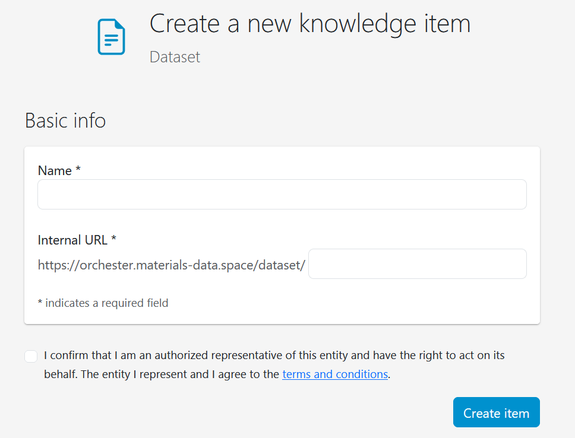

To upload a raw data file into the system and convert it to the resource description format (RDF), you must first develop a data conversion app, which includes a mapping file that relates the terms used in the raw data file to the ontological concepts employed by the system. Detailed instructions for writing data conversion apps can be found in the [DSMS-SDK documentation](https://dsms-python-sdk.readthedocs.io/en/latest/). Once the app is written and registered, you can specify it using the "Plus" button in the "App" section. Remember to toggle on the "trigger upon upload" button and specify the file extension.

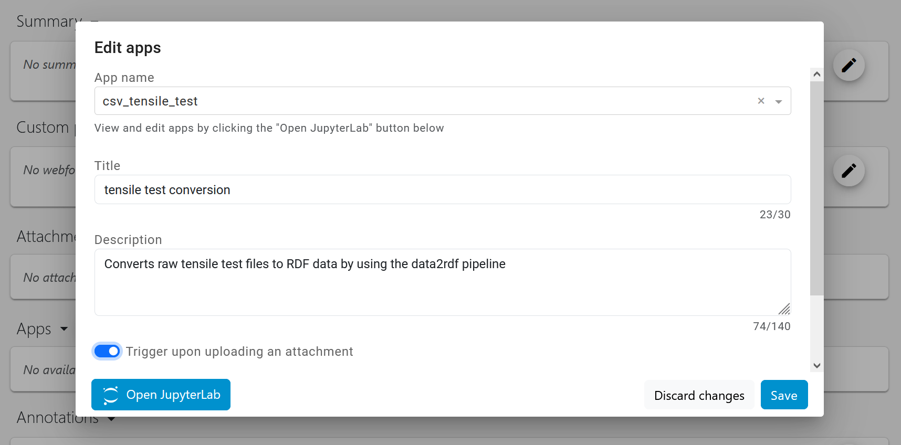

After specifying the app, you can easily integrate information from raw data files into the system as an attachment to the k-item using the drag-and-drop feature.

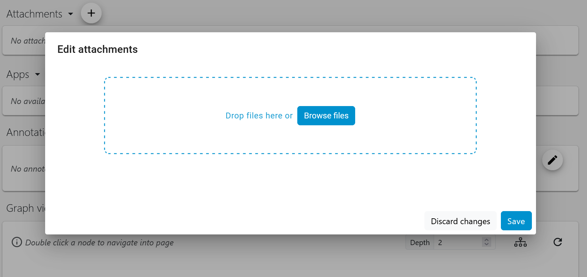

If everything went successful, you will find metadata information and time series data in the corresponding sections of the k-item page.

### Creating a k-item using a webform

Depending on the k-type of the k-item being created, you can fill in the metadata directly via a webform. Similar to the previous method, create a new k-item of a specific k-type (here for example, k-item of type manufacturing process defined in the context of the [StahlDigital project](https://material-digital.de/project/6)). Specify a name, confirm your entry, and click "Create item" to access an empty k-item page. In the metadata section, you can then directly input the relevant metadata.

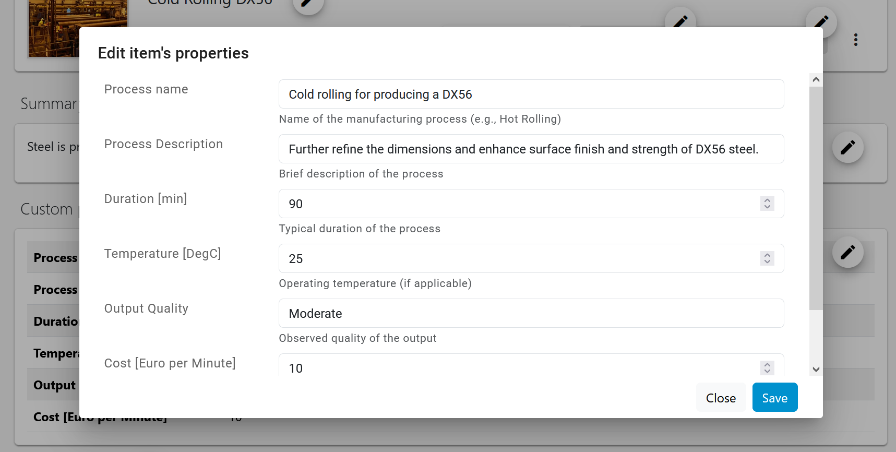

The created k-item can be linked to existing k-items using the "Connection" section.